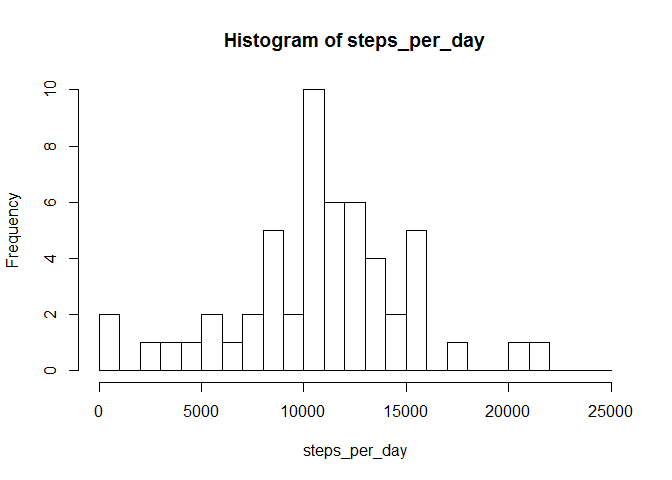
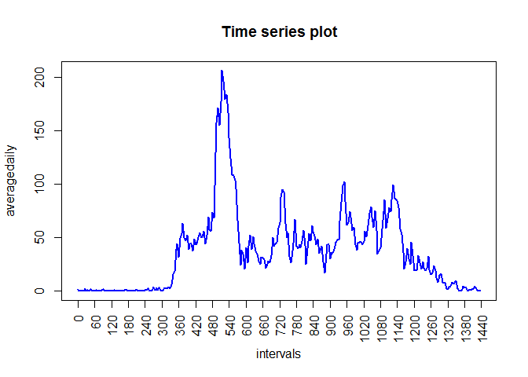
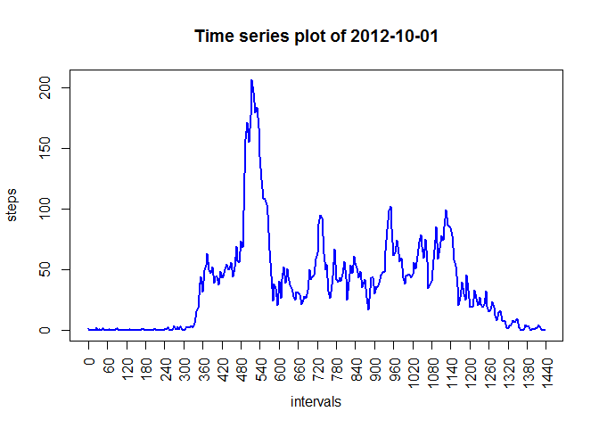
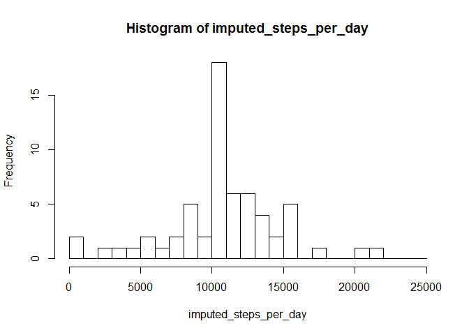
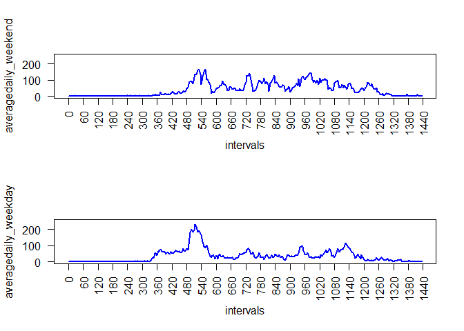

# Reproducible Research: Peer Assessment 1

### Loading and preprocessing the data

After having downloaded the data from [link](https://class.coursera.org/repdata-008/human_grading/view/courses/972599/assessments/3/submissions) to the working directory, we can load it. To have an idea of how the data looks like, we can use the R-functions head and str.


```r
data <-read.csv(unz("activity.zip","activity.csv"), header=T, sep=",", na.strings="NA")
head(data)
```

```
##   steps       date interval
## 1    NA 2012-10-01        0
## 2    NA 2012-10-01        5
## 3    NA 2012-10-01       10
## 4    NA 2012-10-01       15
## 5    NA 2012-10-01       20
## 6    NA 2012-10-01       25
```

```r
str(data)
```

```
## 'data.frame':	17568 obs. of  3 variables:
##  $ steps   : int  NA NA NA NA NA NA NA NA NA NA ...
##  $ date    : Factor w/ 61 levels "2012-10-01","2012-10-02",..: 1 1 1 1 1 1 1 1 1 1 ...
##  $ interval: int  0 5 10 15 20 25 30 35 40 45 ...
```

We transform the 'date' variable into the class Date.  


```r
data$date <- as.Date(data$date)
```

If we take a look at the values of the 'interval' variable, we observe that it increases by 45 at some steps. For instance, the interval 55-60 is indicated by 55, but the interval 60-65 is indicated by 100 (instead of 60). We change the value of the 'interval' variable, such that in each step, it increases by 5.


```r
head(data$interval,n=20)
```

```
##  [1]   0   5  10  15  20  25  30  35  40  45  50  55 100 105 110 115 120
## [18] 125 130 135
```

```r
data$interval <- 60*(data$interval %/% 100)+(data$interval %% 100)
head(data$interval,n=20)
```

```
##  [1]  0  5 10 15 20 25 30 35 40 45 50 55 60 65 70 75 80 85 90 95
```


## What is mean total number of steps taken per day?

We compute the total steps per day and put these values in a vector, called 'steps_per_day'. A summary of this vector is given, together with a histogram.  


```r
steps_per_day <- tapply(data$steps,factor(data$date),sum)
summary(steps_per_day)
```

```
##    Min. 1st Qu.  Median    Mean 3rd Qu.    Max.    NA's 
##      41    8841   10760   10770   13290   21190       8
```

Now, we can make a histogram and compute the mean/median. We first remove the 8 NA-values in the sequence (otherwise we get NA values for the mean/median). Note that the mean/median can also be read off from the summary.


```r
steps_per_day <- steps_per_day[!is.na(steps_per_day)]
hist(steps_per_day,breaks=1000*(0:25))
```

 

```r
mean(steps_per_day)
```

```
## [1] 10766.19
```

```r
median(steps_per_day)
```

```
## [1] 10765
```

## What is the average daily activity pattern?

For this project question, we first compute a sequence 'averagedaily' containing the average number of steps taken, averaged across all days. We remove the NA values by the na.rm=TRUE argument.


```r
averagedaily <- tapply(data$steps,factor(data$interval),mean,na.rm=TRUE)
head(averagedaily)
```

```
##         0         5        10        15        20        25 
## 1.7169811 0.3396226 0.1320755 0.1509434 0.0754717 2.0943396
```

```r
summary(averagedaily)
```

```
##    Min. 1st Qu.  Median    Mean 3rd Qu.    Max. 
##   0.000   2.486  34.110  37.380  52.830 206.200
```

We can make a time series plot of this sequence. Note that there is an x-axis tick for each hour interval (= 60 minutes).


```r
intervals <- unique(data$interval)
plot(intervals, averagedaily, type="l",xaxt="n",xlab="intervals",main="Time series plot", col="blue",lwd=2)
axis(1, xaxp=c(0,24*60,24), las=2)
```

 


For computing the 5-minute interval in which the maximum is attained, we use the which.max function.  


```r
which.max(averagedaily)
```

```
## 515 
## 104
```

The maximum is attained during the 104th 5-minute interval, indicated by `515`. Note that this is the interval denoted by `835`, in the old way of writing down the intervals (since `8*60+35=515`). 

## Imputing missing values

We build a function called 'nacount' that counts the total number of missing values NA is a sequence. We use this function to compute the total number of missing step numbers. Moreover, we provide an overview of the missing step numbers per day.


```r
nacount <- function(x){ sum(is.na(x)) }
nacount(data$steps)
```

```
## [1] 2304
```

```r
tapply(data$steps,factor(data$date),nacount)
```

```
## 2012-10-01 2012-10-02 2012-10-03 2012-10-04 2012-10-05 2012-10-06 
##        288          0          0          0          0          0 
## 2012-10-07 2012-10-08 2012-10-09 2012-10-10 2012-10-11 2012-10-12 
##          0        288          0          0          0          0 
## 2012-10-13 2012-10-14 2012-10-15 2012-10-16 2012-10-17 2012-10-18 
##          0          0          0          0          0          0 
## 2012-10-19 2012-10-20 2012-10-21 2012-10-22 2012-10-23 2012-10-24 
##          0          0          0          0          0          0 
## 2012-10-25 2012-10-26 2012-10-27 2012-10-28 2012-10-29 2012-10-30 
##          0          0          0          0          0          0 
## 2012-10-31 2012-11-01 2012-11-02 2012-11-03 2012-11-04 2012-11-05 
##          0        288          0          0        288          0 
## 2012-11-06 2012-11-07 2012-11-08 2012-11-09 2012-11-10 2012-11-11 
##          0          0          0        288        288          0 
## 2012-11-12 2012-11-13 2012-11-14 2012-11-15 2012-11-16 2012-11-17 
##          0          0        288          0          0          0 
## 2012-11-18 2012-11-19 2012-11-20 2012-11-21 2012-11-22 2012-11-23 
##          0          0          0          0          0          0 
## 2012-11-24 2012-11-25 2012-11-26 2012-11-27 2012-11-28 2012-11-29 
##          0          0          0          0          0          0 
## 2012-11-30 
##        288
```

It seems that on 8 days, such as 2012-10-01, the number of steps were not registered (since there are `24*60/5=288` 5-minute intervals per day). We will fill in the missing data (i.e. number of steps) using the 'averagedaily' sequence. 


```r
imputed_data <- data
for (i in 1:nrow(imputed_data)) {
    if (is.na(imputed_data$steps[i])) {
        imputed_data$steps[i] <- averagedaily[(imputed_data$interval[i]/5)+1]
    }
} 
```

After having done this, the number of NA's should be zero.


```r
nacount(imputed_data$steps)
```

```
## [1] 0
```

To check we did the correct thing in the R-code above, we plot the number of steps in each 5-minute interval for 2012-10-01. We get the same plot as for 'averagedaily'.  


```r
plot(intervals, imputed_data[imputed_data$date=="2012-10-01",]$steps, type="l", xaxt="n", xlab="intervals", ylab="steps", main="Time series plot of 2012-10-01", col="blue", lwd=2)
axis(1, xaxp=c(0,24*60,24), las=2)
```

 

We can again make a histogram of the total number of steps taken each day. 


```r
imputed_steps_per_day <- tapply(imputed_data$steps,factor(imputed_data$date),sum,na.rm=TRUE)
hist(imputed_steps_per_day,breaks=1000*(0:25))
```

 


```r
summary(imputed_steps_per_day)
```

```
##    Min. 1st Qu.  Median    Mean 3rd Qu.    Max. 
##      41    9819   10770   10770   12810   21190
```

```r
mean(imputed_steps_per_day)
```

```
## [1] 10766.19
```

```r
median(imputed_steps_per_day)
```

```
## [1] 10766.19
```

Both the median and mean are equal to `10766.19`. Compared to the mean/median values of 'steps_per_day', the median didn't changed much and the mean is just the same. This is what we expect, since we replaced the days having missing values with an average day. 

## Are there differences in activity patterns between weekdays and weekends?

We create a ne factor variable, called 'factor', with two levels, namely 'weekday' and 'weekend'. A summary of this variable is given.


```r
weekend_days <- c("Saturday","Sunday")
imputed_data$factor <- NULL
for (i in 1:nrow(imputed_data)){
    if (weekdays(imputed_data$date[i]) %in% weekend_days) {
        imputed_data$factor[i] <- "weekend"
    } else {
        imputed_data$factor[i] <- "weekday"
    }
}
imputed_data$factor <- as.factor(imputed_data$factor)
summary(imputed_data$factor)
```

```
## weekday weekend 
##   12960    4608
```

We compute the average number of steps taken, averaged across all weekday days and all weekend days.  


```r
data_weekend <- imputed_data[imputed_data$factor=="weekend",]
averagedaily_weekend <- tapply(data_weekend$steps,factor(data_weekend$interval),mean)
data_weekday <- imputed_data[imputed_data$factor=="weekday",]
averagedaily_weekday <- tapply(data_weekday$steps,factor(data_weekday$interval),mean)
```

We can make a panel plot. 


```r
par(mfrow=c(2,1))
plot(intervals, averagedaily_weekend, type="l",xaxt="n",ylim=c(0,250),yaxt="n",xlab="intervals",col="blue",lwd=2)
axis(1, xaxp=c(0,24*60,24), las=2)
axis(2, at=c(0,100,200), las=2)
plot(intervals, averagedaily_weekday, type="l",xaxt="n",ylim=c(0,250),yaxt="n",xlab="intervals",col="blue",lwd=2)
axis(1, xaxp=c(0,24*60,24), las=2)
axis(2, at=c(0,100,200), las=2)
```

 

During weekdays, the individual who collected the data was more active during the morning (see the peak around 480-540 minutes). Probably, he/she got up earlier (probably around 6 am, since there is activity from the 360 minute interval). During the weekend, the activity was more spread out.
